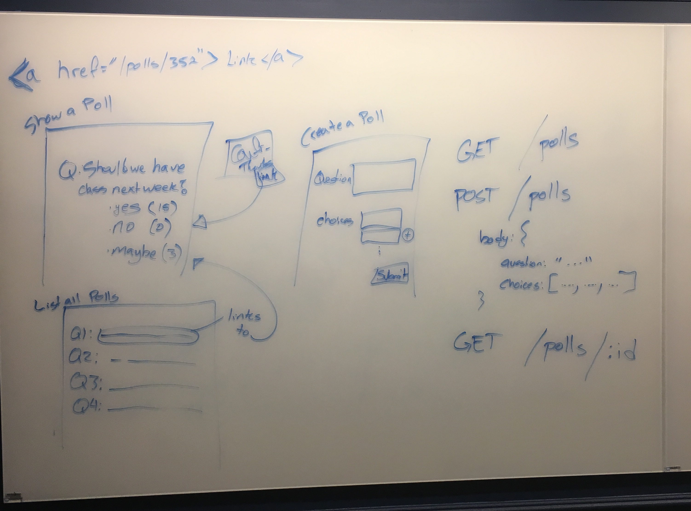

# Week 06 Projects

## Backend Starter Code

You can use this [backend starter code](backend-starter-code/) for your own projects that require a node/express/sequelize backend server.

## Project 01: Build a Poll app

In class we designed and implemented a Poll app. The Poll app should allow the following:

- Users can create new polls.
- A poll consists of a question and 2 or more choices as answers
- Users can vote for one choice in each poll

In class we designed the Poll app together. In each section different features were discussed, such as:

- Allow one vote per user per poll
- Allow only invited users (via email) to answer a poll
- Add a poll expiration date and time
- Allow the reuse of choices (`yes`, `no`, etc...) for multiple polls

But ultimately, we decided that each feature would add more complexity to our implementation. Therefore, we should start only with the core features first, and then build the additional features on top of our first version (_this is agile development!_).

Here is an example design from class:




### What we built 

In some sections we built the `user` and `poll/question` association, in other sections we only built the `poll/question` and `choice` association. Both are good starting points.

The code in the `/poll-app` directory is based on the `/backend-starter-code`. In class, we developed code for the _models_ and _controllers_, and instead of views, we used __Postman__ to interact with our backend.

The files we added were:

- `/models/polls.js`
- `/models/choices.js`
- `/controllers/polls.js`
- and we updated the `/config/config.json` file.


### Additional Tasks (due October 20, 2017)

- Allow the user to update a Poll question text
    + Add a PUT route that allows this
- Allow the user to delete a Poll
    + Add the DELETE route that allows this
    + Should also delete the associated Choices


## Postman and pgAdmin

Using and testing our app is made easier by using **Postman** to interact with the routes and **pgAdmin** to inspect the database (Mac users can also take a look at _Valentina Studio_).

#### Linux Users

**Postman**

Use the following commands:

```
wget https://dl.pstmn.io/download/latest/linux64 -O postman.tar.gz
sudo tar -xzf postman.tar.gz -C /opt
rm postman.tar.gz
sudo ln -s /opt/Postman/Postman /usr/bin/postman
```

You can now type `postman` on the command line to launch postman

**pgAdmin**

Use the following commands:

```
sudo apt-get update
sudo apt-get install pgadmin3
```

You can now type `pgadmin3` on the command line to launch pgadmin 3

#### Mac Users

Both **Postman** and **pgAdmin** can be installed by downloading the apps directly from their websites:

- Postman: https://www.getpostman.com/
- pgAdmin4: https://www.pgadmin.org/download/pgadmin-4-macos/
- Valentina Studio: (search for it in Mac App Store)

**Or,** you can install them using homebrew as follows:

```
brew tap caskroom/cask
brew cask install postman
brew cask install pgadmin4
brew cask install valentina-studio
```


